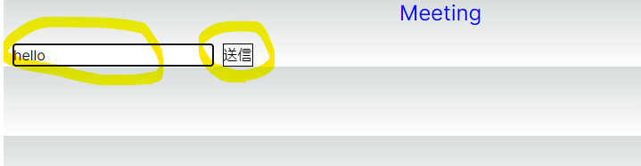
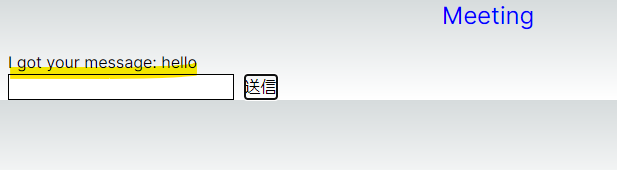

# 案件向けてデモ

#### これは作者が半日かけて完成させたデモです。作者のWebSocketとNext.jsのスキルを顧客に示すために作成されました。

#### 前端プロジェクトでは、yarnを使用して管理を行い、websocketコンポーネントをインストールするために最初にyarn add websocketを使用する必要があります。 

### 構成
このデモはフロントエンドとバックエンドの2つの部分で構成されています。バックエンドではPythonのWebSocketのサードパーティライブラリを使用してWebSocketサービスを実装しています。
フロントエンドではNext.jsを使用してページと会議室でのメッセージ送信機能を実装しています。
ページのルーティングは独自に作成する必要はありません。Next.jsのルールに従って新しいページファイルを作成するだけです。

### 会議の機能
会議の機能はsrc/app/meeting/のパスにあり、その中にはpage.tsxファイルとcssファイルが含まれています。
会議の機能はWebSocketを使用してサーバーにメッセージを送信し、サーバーから返されたデータを受け取り、最後にページ上に表示することができます。

### 効果は画像の通りです。

